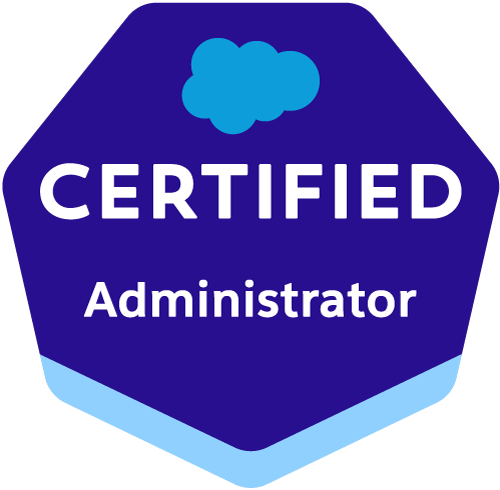

<!-- Typing Animation -->

  

## 👩‍💻 About Me

I'm a Salesforce CRM & Automation Specialist focused on AI-driven and multi-cloud solutions.

I connect Salesforce ecosystems with external services, APIs and intelligent cloud platforms, transforming business processes into scalable technical solutions.

Currently expanding my expertise in:

- Azure AI Services  
- Google Cloud (Vertex AI & Generative AI)  
- LLM-powered automation  
- Multi-cloud AI integrations  

---

## 🚀 What I Do

🔹 Salesforce Automation (Flow, Apex, Validation Rules)  
🔹 API Integrations (REST, Callouts, External Services)  
🔹 AI + Salesforce Integration  
🔹 Azure AI (Document Intelligence, AI Studio)  
🔹 Google Cloud AI (Vertex AI, Generative Services)  
🔹 Business Process Optimization  

## 🛠 Tech Stack

### Salesforce

### ☁️ AI & Multi-Cloud

### Data & Query

---
  

## 🏆 Principais Certificações

> 
> **Salesforce Certified Administrator**  
> Administração de Salesforce, automações e boas práticas em CRM.  
>  
>  

---

> 
> **Flosum Certified Professional**  
> DevOps Salesforce com versionamento, branching e deploy controlado.  
>  
>  

---

  

## 🌍 Career Focus

Focused on building intelligent and scalable integrations that combine:

- Salesforce automation and data modeling  
- Multi-cloud AI services (Azure & Google Cloud)  
- Generative AI and LLM-powered workflows  
- Secure and reliable API integrations  

Continuously evolving as a technical specialist in CRM and AI-driven solutions.
